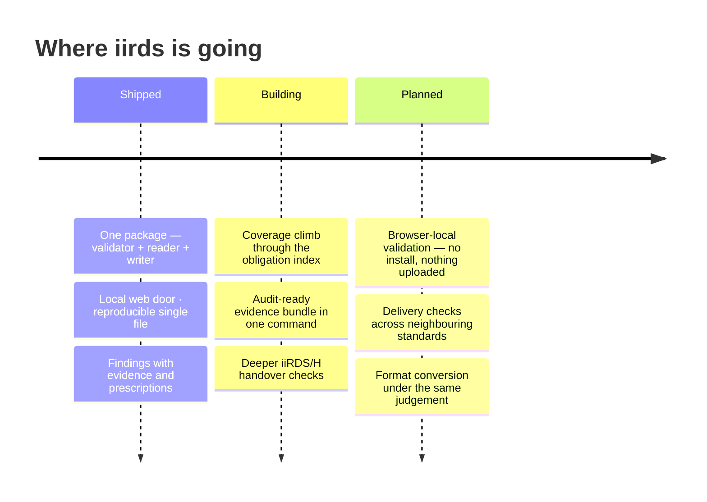

<div align="center">
  

[](https://github.com/dev365code/iirds-validate/actions/workflows/ci.yml)
[](https://pypi.org/project/iirds/)
[](docs/requirements.json)
[](LICENSE)

[Ten seconds](#ten-seconds) · [What it catches](#what-it-catches) · [The local web door](#the-local-web-door) · [Where it sits](#where-it-sits) · [Five doors](#five-doors-one-judgement) · [Honest coverage](#honest-coverage) · [Roadmap](#roadmap) · [In your product](#using-this-validator-in-your-product)

</div>

## Ten seconds


**Three parts, every time: what is wrong → the evidence as read from your file → how to fix it.** A rule without a prescription does not ship.

> [!TIP]
> No install for a first try: `uvx iirds check package.iirds` runs it in a throwaway environment.

<details>
<summary>The same output as copyable text</summary>

```text
$ iirds check broken.iirds

broken.iirds   iiRDS not declared
  note: no iirds:iiRDSVersion in the package; validated against 1.3.
  note: metadata read from META-INF/metadata.rdf

  ERROR C5        mimetype must contain exactly 'application/iirds+zip' with no line ending
                      mimetype
                      b'application/zip'
                    → Make the file contain exactly application/iirds+zip, ASCII, with no
                    → trailing newline and no byte order mark. Editors add both silently, so
                    → write it with a tool that does not.
  ERROR M3        metadata declares no iirds:Package for this container
                    → Provide exactly one iirds:Package instance describing this container. It
                    → is the root a consumer starts from, so zero leaves the package
                    → unidentified and two leave it ambiguous.

  FAIL  2 error(s), 0 warning(s), 0 informational
  164 rules checked, 21 not applicable to this version/variant
```

</details>

## What it catches

| You ship this | iirds says |
|---|---|
| `mimetype` containing `application/zip` | `ERROR C5` — must be exactly `application/iirds+zip`, and the fix names the editors that break it |
| metadata with no `iirds:Package` root | `ERROR M3` — zero leaves the package unidentified, two leave it ambiguous |
| a Package that identifies no product variant while every Document looks fine | `ERROR R13` — the Package itself must say what it documents |
| a vCard reference pasted as a plain string | `ERROR R12` — a reference must be a resource, not a literal |
| a zip bomb, or XML with external entities | refused safely — bounded reads, no entity expansion |

Every code carries a prescription and the section of the specification it enforces — `iirds rules C5 -v` shows any rule's source and remedy.

## The local web door

**For people who do not read terminals** — that is literally what the help says:

```text
$ iirds serve
```

opens a drop page on your own machine: drag a package, read the verdict. Loopback only — any other host is refused by design. Nothing is uploaded anywhere, because there is nowhere to upload to.

## Where it sits


**The referee between producer and receiver.** Same file → same verdict, byte for byte — no uploads, no telemetry, no model in the judgement loop.

## Five doors, one judgement

| Door | For | What you get |
|---|---|---|
| `iirds check` | a person at a terminal | colour, evidence, prescriptions |
| `iirds serve` | non-developers | a local drop page, loopback only |
| `iirds check -f json` | CI and pipelines | machine-readable findings, exit codes |
| `import iirds` | Python programs | reader + writer as a library |
| `iirds.pyz` | locked-down machines | one reproducible file, no install — see [docs/offline-install.md](docs/offline-install.md) |

## Honest coverage

The 1.3 specification index in this repository counts **280 published obligations** ([docs/requirements.json](docs/requirements.json)); the rules currently cover **77 of them — a floor, not a ceiling** ([docs/rule-coverage.json](docs/rule-coverage.json)), and the number is re-measured on every release.

> [!IMPORTANT]
> A clean run means **nothing wrong in what we check** — never "conformant". Tools silent about this difference are selling a feeling.

## Why trust the answer

- **Deterministic** — same file, same verdict, byte for byte.
- **Offline** — your documents never leave your machine.
- **Self-tested** — rules are verified against their own mutations before they ship.
- **A public divergence ledger** — where our reading differs, [it is recorded with reasons](docs/divergences.md).

## Roadmap

An item moves right only when it is **built and verified**.



## When iirds is not the tool

- **Authoring or fixing content** — iirds judges packages; it does not create them (though every finding tells you the fix).
- **Certification** — no tool can declare legal conformance. The declaration stays yours.
- **Neighbouring standards** — for VDI 2770 containers or AAS submodels, use the sibling judges built the same way: [vdi2770-validate](https://github.com/dev365code/vdi2770-validate), [aas-submodel-validate](https://github.com/dev365code/aas-submodel-validate).

## Using this validator in your product

<details>
<summary>Apache-2.0 — <b>embed freely; the judgement never has a paid tier</b></summary>

Embed it in commercial products, ship it to customers, run it in closed networks — keep the LICENSE and NOTICE files with it. A validation run makes no network requests and uploads nothing. Stable surfaces: the CLI options documented above and the exit codes; changes there are announced as breaking. A free run and a supported run give the same result on the same file; professional support covers the work around it — update guarantees when the specification changes, backports to a version you have frozen, help with embedding and integration, change-impact notes. Contact: zero8004paz@gmail.com · security reports: [SECURITY.md](SECURITY.md)

</details>

## As a library

```python
import iirds, iirds_validate

pkg = iirds.open("release.iirds")               # reader: metadata graph, files
report = iirds_validate.check("release.iirds")  # the judge, as a function
```

The reader ships with one dependency and no verdicts; the judge imports the reader, never the other way around.

## Stewardship

**The judgement matters more than the name.** `iirds` on PyPI is used descriptively and held in stewardship: should the iiRDS Consortium want it for an official SDK, it will be transferred on request. Until then it does real work rather than squatting.

---

<sub>Numbers above are re-measured on every release · findings are judgements about files, never about people · Apache-2.0</sub>
