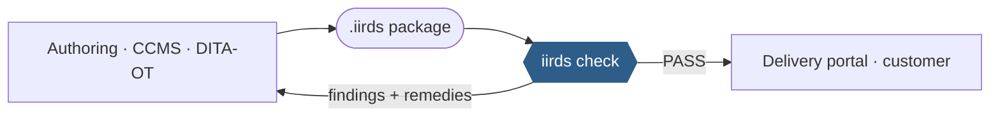
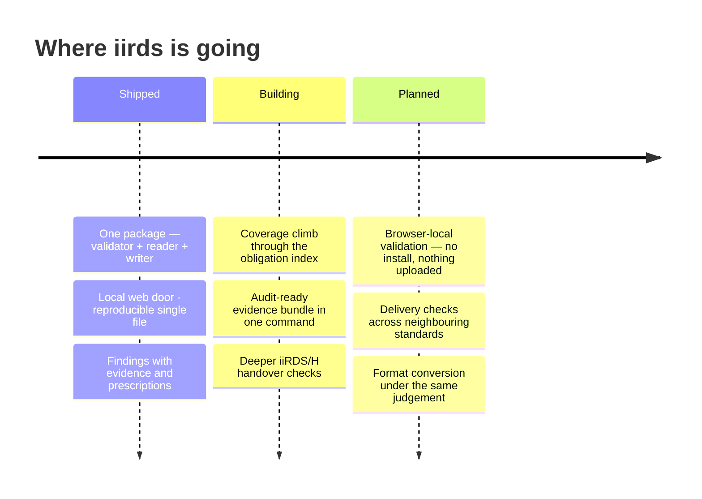

<div align="center">
  

[](https://github.com/dev365code/iirds-validate/actions/workflows/ci.yml)
[](https://pypi.org/project/iirds/)
[](https://github.com/dev365code/iirds-validate/blob/main/docs/requirements.json)
[](https://github.com/dev365code/iirds-validate/blob/main/LICENSE)

&nbsp;**Apache-2.0**&nbsp;·&nbsp;**Python 3.9–3.13**&nbsp;·&nbsp;**Linux · macOS · Windows**&nbsp;·&nbsp;**zero network, by design**

[Ten seconds](#ten-seconds) · [What it catches](#what-it-catches) · [The local web door](#the-local-web-door) · [Where it sits](#where-it-sits) · [Five doors](#five-doors-one-judgement) · [Honest coverage](#honest-coverage) · [Roadmap](#roadmap) · [In your product](#using-this-validator-in-your-product)

</div>

## Ten seconds


```console
$ pip install iirds
```

**Three parts, every time: what is wrong → the evidence as read from your file → how to fix it.** A rule without a prescription does not ship. The old distribution name `iirds-validate` and the short command `iirdsv` remain as aliases of the same package.

> [!TIP]
> No install for a first try: `uvx iirds check package.iirds` runs it in a throwaway environment.

<details>
<summary>A second sample, generated and verified by the test suite</summary>

```console
$ iirds manual.iirds
manual.iirds   iiRDS 1.3
  note: metadata read from META-INF/metadata.rdf

  ERROR M11       Rendition must have exactly one iirds:format
                      urn:example:manual has-rendition
                      0 found
                    → Give the Rendition exactly one iirds:format, holding the media type of the
                    → file it points at, for example application/xhtml+xml or application/pdf.
                    → Add one if there is none; remove the extras if there are several.
  WARN  L1        relation points at an IRI that is never described in this package
                      urn:example:event/al-204
                      referenced by Operating manual via relates-to-event
                    → Either describe the target in this package, or drop the reference. A
                    → relation pointing at an IRI nothing here mentions gives a consumer a name
                    → and no way to resolve it.

  FAIL  1 error(s), 1 warning(s), 0 informational
  189 rules checked, 24 not applicable to this version/variant (22 for iiRDS/H, 2 for other editions)
$ echo $?
1
```

</details>

## What it catches

| You ship this | iirds says |
|---|---|
| `mimetype` containing `application/zip` | `ERROR C5` — must be exactly `application/iirds+zip`, and the fix names the editors that break it |
| metadata with no `iirds:Package` root | `ERROR M3` — zero leaves the package unidentified, two leave it ambiguous |
| a Package that identifies no product variant while every Document looks fine | `ERROR R13` — the Package itself must say what it documents |
| a vCard reference pasted as a plain string | `ERROR R12` — a reference must be a resource, not a literal |
| a zip bomb, or XML with external entities | refused safely — bounded reads, no entity expansion |

Every code carries a prescription and the section of the specification it enforces — `iirds rules C5 -v` shows any rule's source and remedy.

**It asks whether the package will work, not only whether it conforms.** Sixteen
interoperability rules, most with no counterpart in the specification, because a
conformant package can still be undeliverable:

<details>
<summary>The fifteen, briefly</summary>

| | |
|---|---|
| L1 | a relation points at an IRI the package never describes |
| L2 | `iirds:source` names a file that was not packed |
| L3 | a directory node unreachable from any root — invisible in every viewer |
| L4 | a cycle in the navigation structure |
| L5 | a proprietary class not linked to any iiRDS class |
| L6 | a metadata value with no label a consumer could display or match |
| L7 | an information unit with no title |
| L8 | references out to vocabularies an offline consumer cannot resolve |
| L9 | the RDF/XML and JSON-LD metadata describe different graphs |
| L10 | an abstract iiRDS class used to type an instance directly |
| L11 | content named `.xhtml` but declared as another media type, so nothing checked it |
| L12 | two entries differing only in case, so one is lost when the package is unpacked |
| L13 | a name in the iiRDS namespace that the standard does not define, with the term that was probably meant |
| L14 | a namespace one character from an iiRDS namespace, so that every name under it resolves to nothing |
| L15 | a name from a later edition of iiRDS than the package declares, so a consumer reading it as declared has no definition for it |
| L16 | a relation carrying text where a reference belongs, so the relation exists and its target does not |

</details>

## The local web door

**For people who do not read terminals** — that is literally what the help says:

```text
$ iirds serve
```

opens a drop page on your own machine: drag a package, read the verdict. Loopback only — any other host is refused by design. Nothing is uploaded anywhere, because there is nowhere to upload to.

## Where it sits



**The referee between producer and receiver.** Same file → same verdict, byte for byte — no uploads, no telemetry, no model in the judgement loop.

## Five doors, one judgement

| Door | For | What you get |
|---|---|---|
| `iirds check` | a person at a terminal | colour, evidence, prescriptions |
| `iirds serve` | non-developers | a local drop page, loopback only |
| `iirds check -f json` | CI and pipelines | machine-readable findings, exit codes |
| `import iirds` | Python programs | reader + writer as a library |
| `iirds.pyz` | locked-down machines | one reproducible file, no install — see [docs/offline-install.md](https://github.com/dev365code/iirds-validate/blob/main/docs/offline-install.md) |

## Honest coverage

> **At a glance** — 213 rules across five editions and three profiles · 154 SHACL shapes
> carrying the language-neutral encoding · one pure-Python dependency (rdflib), zero for
> the single-file `.pyz` · every number in this section is read by a test that fails the
> build when it goes stale.

```console
$ iirds rules
container  19/19    the ZIP and its layout  +3 of its own
schema     135/135  the metadata graph  +19 of its own
system     3/3      the run itself  +7 of its own
content    -        iiRDS XHTML5 (Appendix B)  +11 of its own
lint       -        will a consumer be able to use it  +16 of its own
```

157 of 157 catalogued rules, plus 56 of this project's own.

| kind | catalogued | this project |
|---|---|---|
| container (C\*) | 19 / 19 | 3 |
| schema (M\*) | 135 / 135 | 19 |
| system (S\*) | 3 / 3 | 7 |
| content (B\*) | — | 11 |
| interoperability (L\*) | — | 16 |

Coverage of the catalogue is not coverage of the standard. The specification states
**280 absolute obligations**, counted by
[`tools/extract_requirements.py`](https://github.com/dev365code/iirds-validate/blob/main/tools/extract_requirements.py) and listed in
[docs/requirements.json](https://github.com/dev365code/iirds-validate/blob/main/docs/requirements.json); the rules currently cover
**131 of them — a floor, not a ceiling** ([docs/rule-coverage.json](https://github.com/dev365code/iirds-validate/blob/main/docs/rule-coverage.json)),
re-measured on every release.

> [!IMPORTANT]
> A clean run means **nothing wrong in what we check** — never "conformant". Tools silent about this difference are selling a feeling.

- **Every finding says what to do about it.** All 213 rules carry one imperative
  sentence naming the change, and a test refuses a rule that does not.
- **Every rule has been watched fire.** The suite records which rule ids actually
  produce a finding, and 212 of the 213 have — the remaining one is a `MAY` with
  nothing to violate.
- **What is not established.** The 56 rules this project invented have no second
  implementation to be compared against; [docs/divergences.md](https://github.com/dev365code/iirds-validate/blob/main/docs/divergences.md)
  records where this project reads the specification differently, with reasons.


## Why trust the answer

- **Deterministic** — same file, same verdict, byte for byte.
- **Offline** — your documents never leave your machine.
- **Self-tested** — rules are verified against their own mutations before they ship.
- **A public divergence ledger** — where our reading differs, [it is recorded with reasons](https://github.com/dev365code/iirds-validate/blob/main/docs/divergences.md).

## Roadmap

An item moves right only when it is **built and verified**.



## When iirds is not the tool

- **Authoring or fixing content** — iirds judges packages; it does not create them (though every finding tells you the fix).
- **Certification** — no tool can declare legal conformance. The declaration stays yours.
- **Neighbouring standards** — for VDI 2770 containers or AAS submodels, use the sibling judges built the same way: [vdi2770-validate](https://github.com/dev365code/vdi2770-validate), [aas-submodel-validate](https://github.com/dev365code/aas-submodel-validate).

## Using this validator in your product

<details>
<summary>Apache-2.0 — <b>embed freely; the judgement never has a paid tier</b></summary>

Embed it in commercial products, ship it to customers, run it in closed networks — keep the LICENSE and NOTICE files with it. A validation run makes no network requests and uploads nothing. Stable surfaces: the CLI options documented above and the exit codes; changes there are announced as breaking. A free run and a supported run give the same result on the same file; professional support covers the work around it — update guarantees when the specification changes, backports to a version you have frozen, help with embedding and integration, change-impact notes. Contact: zero8004paz@gmail.com · security reports: [SECURITY.md](https://github.com/dev365code/iirds-validate/blob/main/SECURITY.md)

</details>

## Reading and writing packages from Python

```python
import iirds, iirds_validate

pkg = iirds.open("release.iirds")               # reader: metadata graph, files
report = iirds_validate.check("release.iirds")  # the judge, as a function
```

The reader ships with one dependency and no verdicts; the judge imports the reader, never the other way around.

## Stewardship

The `iirds` name on PyPI belongs to the standard's community more than to any
one project. **Should the iiRDS Consortium want this name for an official
SDK, it will be transferred on request** — until then it does real work
rather than squatting. `iirds-sdk` is an alias of this package and travels
under the same pledge.

This is an unofficial project, not affiliated with or endorsed by the iiRDS
Consortium or tekom Deutschland e.V. "iiRDS" is used descriptively, to name
the standard these functions read and write.

## Licence

Apache-2.0 — see [LICENSE](https://github.com/dev365code/iirds-validate/blob/main/LICENSE).

The bundled iiRDS ontologies are © tekom Deutschland e.V. / iiRDS Consortium
under **CC BY-ND 4.0** and are redistributed verbatim; the rule catalogue is
derived from plusmeta's MIT-licensed tool. CC BY-ND is not an OSI-approved
licence, so this distribution is not wholly open source even though the code is
— [docs/licensing.md](https://github.com/dev365code/iirds-validate/blob/main/docs/licensing.md) explains what that means for you and
what would fix it. Provenance in [NOTICE](https://github.com/dev365code/iirds-validate/blob/main/NOTICE) and
[THIRD_PARTY.md](https://github.com/dev365code/iirds-validate/blob/main/THIRD_PARTY.md).

Not affiliated with, endorsed by, or certified by the iiRDS Consortium, tekom
Deutschland e.V., plusmeta GmbH or Quanos Solutions GmbH. "iiRDS" is used
descriptively to name the standard this tool validates against.

---

<sub>Numbers above are re-measured on every release · findings are judgements about files, never about people</sub>
