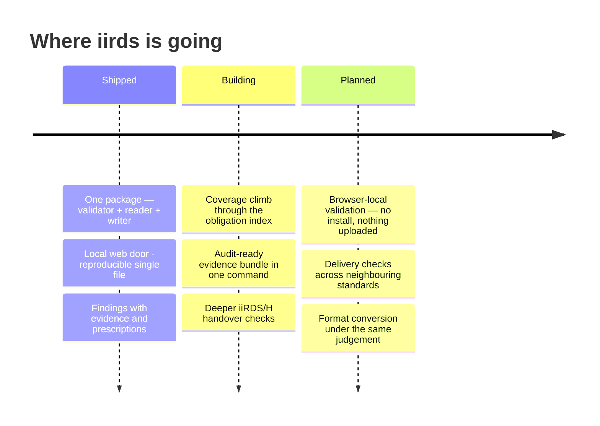

<div align="center">
  

[](https://github.com/dev365code/iirds-validate/actions/workflows/ci.yml)
[](https://pypi.org/project/iirds/)
[](https://github.com/dev365code/iirds-validate/blob/main/docs/requirements.json)
[](https://github.com/dev365code/iirds-validate/blob/main/LICENSE)

&nbsp;**Apache-2.0**&nbsp;·&nbsp;**Python 3.9–3.13**&nbsp;·&nbsp;**Linux · macOS · Windows**&nbsp;·&nbsp;**zero network, by design**

[Ten seconds](#ten-seconds) · [What it catches](#what-it-catches) · [The local web door](#the-local-web-door) · [Where it sits](#where-it-sits) · [Every door](#every-door-one-judgement) · [Honest coverage](#honest-coverage) · [Roadmap](#roadmap) · [In your product](#using-this-validator-in-your-product)

</div>

## Ten seconds


```console
$ pip install iirds
```

**Three parts: what is wrong → the evidence as read from your file, where the fault leaves any → how to fix it.** A rule without a prescription does not ship. The old distribution name `iirds-validate` and the short command `iirdsv` remain as aliases of the same package.

> [!TIP]
> No install for a first try: `uvx iirds check package.iirds` runs it in a throwaway environment.

> [!IMPORTANT]
> **Coming from `iirds-validate` 0.4.2 or earlier: uninstall before you install.**
> `pip install -U iirds-validate` leaves that environment with no working command
> — and `pip list` and `pip check` both report it healthy, because nothing is
> missing as far as pip is concerned. `iirds-validate` 0.5.0 and later carry no
> files of their own, so pip writes the new package's copy of `iirds_validate/`
> and then removes the old distribution, which deletes every path the two
> records share.
>
> ```console
> $ pip uninstall -y iirds-validate     # first
> $ pip install -U iirds
> ```
>
> If it already happened, this restores it — the files were deleted, not the
> package record:
>
> ```console
> $ pip install --force-reinstall --no-deps iirds
> ```
>
> Upgrading from 0.5.0 or later is unaffected.

<details>
<summary>A second sample, generated and verified by the test suite</summary>

```console
$ iirds manual.iirds
manual.iirds   iiRDS 1.3
  note: metadata read from META-INF/metadata.rdf

  ERROR M11       Rendition must have exactly one iirds:format
                      urn:example:manual has-rendition
                      0 found
                    → Give the Rendition exactly one iirds:format, holding the media type of the
                    → file it points at, for example application/xhtml+xml or application/pdf.
                    → Add one if there is none; remove the extras if there are several.
  WARN  L1        relation points at an IRI that is never described in this package
                      urn:example:event/al-204
                      referenced by Operating manual via relates-to-event
                    → Either describe the target in this package, or drop the reference. A
                    → relation pointing at an IRI nothing here mentions gives a consumer a name
                    → and no way to resolve it.

  FAIL  1 error(s), 1 warning(s), 0 informational
  208 rules checked, 28 not applicable to this version/variant (26 for iiRDS/H, 2 for other editions)
$ echo $?
1
```

</details>

## What it catches

| You ship this | iirds says |
|---|---|
| `mimetype` containing `application/zip` | `ERROR C5` — must be exactly `application/iirds+zip`, and the fix names the editors that break it |
| metadata with no `iirds:Package` root | `ERROR M3` — zero leaves the package unidentified, two leave it ambiguous |
| an iiRDS/H package (iiRDS 1.3) whose Package identifies no product variant while every Document looks fine | `ERROR R13` — under iiRDS/H the Package itself must say what it documents |
| a vCard reference pasted as a plain string | `ERROR R12` — a reference must be a resource, not a literal |
| a zip bomb, or XML with external entities | every read is bounded, an entry whose compression method cannot be read within a bound is not opened at all (`ERROR S14`), and no entity is expanded. `SECURITY.md` says what these limits reach and what they do not |

Every code carries a prescription, and a rule that claims a sentence of the specification names the section it claims — `iirds rules C5 -v` shows any rule's source and remedy. A rule that claims none names none -- most interoperability and system rules are of that kind, being this project's own or about the run rather than the package -- and `iirds rules S1 -v` prints a remedy with no section beside it.

**It asks whether the package will work, not only whether it conforms.** Sixteen
interoperability rules, most with no counterpart in the specification, because a
conformant package can still be undeliverable:

<details>
<summary>One line each</summary>

| | |
|---|---|
| L1 | a relation points at an IRI the package never describes |
| L2 | `iirds:source` names a file that was not packed |
| L3 | a directory node unreachable from any root — invisible to a viewer that walks the tree from its roots |
| L4 | a cycle in the navigation structure |
| L5 | a proprietary class that types an instance but has no `rdfs:subClassOf` or `owl:equivalentClass` of its own into iiRDS (a link through another proprietary class is not followed) |
| L6 | a metadata value with no label a consumer could display or match |
| L7 | an information unit with no title |
| L8 | references out to vocabularies an offline consumer cannot resolve |
| L9 | the RDF/XML and JSON-LD metadata describe different graphs |
| L10 | an abstract iiRDS class used to type an instance directly |
| L11 | a rendition naming a `.xhtml` file under another media type — no content rule reads the file through it |
| L12 | two entries differing only in case, so one is lost when the package is unpacked onto a case-insensitive filesystem (Windows, and macOS by default) |
| L13 | a name in the iiRDS namespace that the standard does not define, and the term that was probably meant when one defined name is clearly nearest |
| L14 | a namespace one character from an iiRDS namespace, so that every name under it resolves to nothing |
| L15 | a name from a later edition of iiRDS than the package declares, so a consumer reading it as declared has no definition for it |
| L16 | a relation carrying text where a reference belongs, so the relation exists and its target does not |

</details>

## The local web door

**For people who do not read terminals** — that is literally what the help says:

```text
$ iirds serve
```

opens a drop page on your own machine: drag a package, read the verdict. Loopback only — any other host is refused by design. Nothing is uploaded anywhere, because there is nowhere to upload to.

## Where it sits


**The referee between producer and receiver.** Same file → same verdict, byte for byte — no uploads, no telemetry, no model in the judgement loop.

## Every door, one judgement

| Door | For | What you get |
|---|---|---|
| `iirds check` | a person at a terminal | colour, evidence, prescriptions |
| `iirds serve` | non-developers | a local drop page, loopback only |
| `iirds check -f json` | CI and pipelines | machine-readable findings, exit codes |
| `iirds diff` | anyone who kept a machine-readable report (`-f json`) from 0.7.1 or later | what changed since it, and what moved underneath the comparison |
| `import iirds, iirds_validate` | Python programs | a reader and writer, and the judge as a function |
| `iirds.pyz` | locked-down machines | one file, no install, byte-identical when rebuilt from one commit, one set of dependency versions and one `SOURCE_DATE_EPOCH` (a fixed date when unset) on the same kind of system — see [docs/offline-install.md](https://github.com/dev365code/iirds-validate/blob/main/docs/offline-install.md) |

## Honest coverage

> **At a glance** — 236 rules across five editions and three profiles · 169 SHACL shapes
> carrying the language-neutral encoding · one pure-Python dependency (rdflib), zero for
> the single-file `.pyz` · every number in this section is read by a test that fails the
> build when it goes stale.

```console
$ iirds rules
container  19/19    the ZIP and its layout  +4 of its own
schema     135/135  the metadata graph  +35 of its own
system     3/3      the run itself  +13 of its own
content    -        iiRDS XHTML5 (Appendix B)  +11 of its own
lint       -        will a consumer be able to use it  +16 of its own
```

157 of 157 catalogued rules, plus 79 of this project's own.

| kind | catalogued | this project |
|---|---|---|
| container (C\*) | 19 / 19 | 4 |
| schema (M\*) | 135 / 135 | 35 |
| system (S\*) | 3 / 3 | 13 |
| content (B\*) | — | 11 |
| interoperability (L\*) | — | 16 |

Coverage of the catalogue is not coverage of the standard. The specification states
**280 absolute obligations**, counted by
[`tools/extract_requirements.py`](https://github.com/dev365code/iirds-validate/blob/main/tools/extract_requirements.py) and listed in
[docs/requirements.json](https://github.com/dev365code/iirds-validate/blob/main/docs/requirements.json); the rules currently cover
**172 of them — a floor, not a ceiling** ([docs/rule-coverage.json](https://github.com/dev365code/iirds-validate/blob/main/docs/rule-coverage.json)),
re-measured on every release.

> [!IMPORTANT]
> A clean run means **nothing wrong in what we check** — never "conformant". Tools silent about this difference are selling a feeling.

- **Every finding says what to do about it.** All 236 rules carry one imperative
  sentence naming the change. A test refuses a rule whose remedy is missing, shorter
  than a sentence, or opens by restating the requirement, and checks the imperative
  shape itself for a few named rules.
- **Every rule that can fire has been watched fire.** The suite records which rule ids actually
  produce a finding, and 235 of the 236 have — the remaining one is a `MAY` with
  nothing to violate.
- **What is not established.** The 79 rules this project invented have no
  implementation elsewhere that this project knows of to compare them against. The SHACL shapes that encode
  some of them are this project's own second encoding, checked against the Python
  rule by rule, which catches a slip in translation but cannot confirm the reading; [docs/divergences.md](https://github.com/dev365code/iirds-validate/blob/main/docs/divergences.md)
  records where this project reads the specification differently, with reasons.


## Why trust the answer

- **Deterministic** — same file, same verdict, byte for byte.
- **Offline** — your documents never leave your machine.
- **Self-tested** — rules are verified against their own mutations before they ship.
- **A public divergence ledger** — where our reading differs, [it is recorded with reasons](https://github.com/dev365code/iirds-validate/blob/main/docs/divergences.md).

## Roadmap

An item moves right only when it is **built and verified**.



## When iirds is not the tool

- **Authoring or fixing content** — iirds judges packages, and can put content and metadata you already have into one (`iirds pack`, or the `iirds` library's writer); it does not author or fix them (though every finding tells you the fix).
- **Certification** — a clean run is not a declaration of conformance. The declaration stays yours.
- **Neighbouring standards** — for VDI 2770 containers or AAS submodels, use the sibling judges built the same way: [vdi2770-validate](https://github.com/dev365code/vdi2770-validate), [aas-submodel-validate](https://github.com/dev365code/aas-submodel-validate).

## Using this validator in your product

<details>
<summary>Apache-2.0 — <b>embed freely; the judgement never has a paid tier</b></summary>

Embed it in commercial products, ship it to customers, run it in closed networks — keep the LICENSE and NOTICE files with it. A validation run makes no network requests and uploads nothing. Stable surfaces: the CLI options documented above and the exit codes; changes there are announced as breaking. A free run and a supported run give the same result on the same file; professional support covers the work around it — update guarantees when the specification changes, backports to a version you have frozen, help with embedding and integration, change-impact notes. Contact: zero8004paz@gmail.com · security reports: [SECURITY.md](https://github.com/dev365code/iirds-validate/blob/main/SECURITY.md)

</details>

### What is stable here, and what is not

**This is 0.x, and the packaging is not the contract.** Three names on PyPI
install the same code, the module layout moves, and what a wheel carries beyond
the command may change in any release.

**The verdicts move, and every move is written down.** A rule's reading is a
claim about the specification, and when a reading changes, so does the verdict
on a package that sits on that line. Those changes are in
[CHANGELOG.md](https://github.com/dev365code/iirds-validate/blob/main/CHANGELOG.md), each with the reading behind it, and a paragraph
that moves an exit code says so in those words. If you gate a build on the exit
code, read that file before upgrading. That much is discipline, not a gate.

**A command line the argument parser rejects exits `64`, not `2`** — breaking, and said here
because the exit codes are a stable surface. A mistyped option and an input
the run could not read both exited `2`, so a build that treats `2` as "this
package could not be judged" was catching its own broken command line and
reporting it as a package problem. `64` is the conventional value for a usage
error (`EX_USAGE`); `2` keeps its present meaning and nothing else moves. Nor
are `iirds serve --host 0.0.0.0` and `iirds rules NOSUCH` usage errors: the
parser accepts both and the command refuses them, with `2`. A
mistyped *verb* typed on its own is not one of these: `iirds <path>` is
shorthand for `iirds all <path>`, so the first word is read as a path and a
misspelt one exits `2` -- `iirds chekc pkg.iirds` exits `2`, naming `chekc` as
the file it could not find. Typed with that verb's own options, `iirds serv
--port 8080` leaves `all` an option it has never had, and that is a usage
error: `64`. What a gate holds is narrower and worth more: a rule id is a
citation somebody else made, so what fired is compared against a committed
record on every build, and a rule that quietly stops firing stops the build.

What has held, and how to see it for yourself. The table below is written by
`tools/gen_stable_section.py` from what those commands print, because a number
typed into prose goes stale on the day the thing it counts moves. The two
packages it names are built rather than shipped -- `make fixtures/good.iirds
fixtures/bad.iirds`, or `python tools/make_fixture_package.py` directly -- so
a fresh clone makes them once and then the commands below are runnable as
written:

<!-- what-has-held: written by tools/gen_stable_section.py -->

| what it says | how to see it | what came back |
|---|---|---|
| The report is a document with a `schemaVersion`, and keys are added without moving it | `iirds check fixtures/good.iirds -f json` | `"schemaVersion": 2`, then `package`, `iirdsVersion`, `validatedAgainst`, `variant`, `ok`, `judgedBy`, `packageDigest`, `summary`, `notes`, `notApplicable`, `suppressed`, `findings` |
| `iirds check` exits `0` when the package drew no error (with `-W`, a warning is one) | `iirds check fixtures/good.iirds; echo $?` | `0` |
| `1` when it did | `iirds check fixtures/bad.iirds; echo $?` | `1` |
| `2` when nothing was judged: a path that is not there, or an input it refused | `iirds check no-such-file.iirds; echo $?` | `2` |
| `64` when the argument parser rejected the command line: an option that is not one, a missing argument, a value outside a fixed list of choices (`serve --host 0.0.0.0`, which it accepts and the command refuses, is `2`) | `iirds check --iirds-version 9.9 fixtures/good.iirds; echo $?` | `64` |
| Every registered rule is answered for: run, or excused with a reason | the same JSON — `judgedBy.rulesRun`, and the top-level `notApplicable` | 194 run and 42 excused, no overlap, together the whole registry of 236; `tests/test_report_envelope.py` holds it. `summary.rulesSkipped` is a different count and not the other half |
| The rule catalogue here was taken from one pinned upstream commit, and says which (whether upstream still matches it is a weekly job, not this one) | `python tools/extract_catalog.py --pin` | `catalogue taken from f1119bea7b64fd826ded9e06d9abae287cbad9c1, retrieved 2026-09-13` |
| The ontologies shipped here are the recorded ones, checked by digest | `python -m iirds_validate.ontology --verify` | 5 files, every one `ok` |
| The ids that fire are the recorded ones | `make check` — the gate is `tools/rule_coverage.py --check`, which reads what a run observed, so a fresh checkout has nothing for it to read yet | a rule that stops firing stops the build |
| A validation run makes no network request | `tests/test_offline.py`, which runs a check with the socket sealed | the suite |

<!-- /what-has-held -->

The two containers the exit-code rows name are built by the repository rather
than committed, and the generator builds them if they are missing; it runs the
checker as `python -m iirds_validate` from the tree, which is the entry point
the `iirds` command is.

What is not the contract, beyond packaging: the set of rules grows, so a count
of them is not a promise; the wording of a finding's message is prose for a
person to read; and the Python names the next section uses -- `iirds.open`,
`iirds_validate.check` -- work, and are meant to, but they are not among the
surfaces whose changes are announced as breaking. What is held still for
another program to depend on is the command, its exit codes, and a report that
says which `schemaVersion` it is.

### Releases and version numbers

**This is 0.x, and a release goes out when something is ready rather than on a
calendar.** While something is being built that can mean a release a night, and
it can equally mean nothing for a fortnight. The number says what changed, not
how long it has been since the last one.

**A patch repairs, and names any verdict it moves.** Mostly a package that
passed goes on passing, and where a repair moves a verdict the changelog says
whose and why: 0.6.2 stopped opening a bzip2 entry, which the standard permits
and this tool will not read within a bound; 0.6.3 failed a container that will
not produce a file it lists. If you gate a build on the exit code, the
changelog is the file to read before upgrading, whichever number moved.

**A minor release may add a verdict or move one, and the changelog names every
package shape whose verdict moved**, with the reading behind it.

**From the release after 0.7.1, a security fix goes out ahead of anything else in
flight**, as a patch on the latest release's line. Before that it did not always: the
fix for GHSA-qwv2-9vgj-vc2w waited for 0.7.1 and shipped with the rest of that release.
From 0.6.1 on, a security fix carries an advisory on this repository's Security tab
naming the versions it reaches and the release that fixes it. `SECURITY.md` lists them.

**Pin what you validated against, and pin `iirds`.** `iirds-validate` and
`iirds-sdk` are aliases that ship no engine of their own, and their dependency
on `iirds` is a floor rather than an exact pin -- so pinning either fixes the
name you install and leaves the rules free to move under it. `iirds==<version>`
is the pin that holds them still.

**1.0 will mean the report schema stops moving.** Until then it may gain
fields, and the coverage figure above is re-measured on every release rather
than promised.

## Reading and writing packages from Python

```python
import iirds, iirds_validate

pkg = iirds.open("release.iirds")               # reader: metadata graph, files
report = iirds_validate.check("release.iirds")  # the judge, as a function
```

The reader ships with one dependency and no verdicts; the judge imports the reader, never the other way around.

## Stewardship

The `iirds` name on PyPI belongs to the standard's community more than to any
one project. **Should the iiRDS Consortium want this name for an official
SDK, it will be transferred on request** — until then it does real work
rather than squatting. `iirds-sdk` is an alias of this package and travels
under the same pledge.

This is an unofficial project, not affiliated with or endorsed by the iiRDS
Consortium or tekom Deutschland e.V. "iiRDS" is used descriptively, to name
the standard these functions read and write.

## Licence

Apache-2.0 — see [LICENSE](https://github.com/dev365code/iirds-validate/blob/main/LICENSE).

The bundled iiRDS ontologies are © tekom Deutschland e.V. / iiRDS Consortium
under **CC BY-ND 4.0** and are redistributed verbatim; the rule catalogue is
derived from plusmeta's MIT-licensed tool. CC BY-ND is not an OSI-approved
licence, so this distribution is not wholly open source even though the code is
— [docs/licensing.md](https://github.com/dev365code/iirds-validate/blob/main/docs/licensing.md) explains what that means for you and
what would fix it. Provenance in [NOTICE](https://github.com/dev365code/iirds-validate/blob/main/NOTICE) and
[THIRD_PARTY.md](https://github.com/dev365code/iirds-validate/blob/main/THIRD_PARTY.md).

Not affiliated with, endorsed by, or certified by the iiRDS Consortium, tekom
Deutschland e.V., plusmeta GmbH or Quanos Solutions GmbH. "iiRDS" is used
descriptively to name the standard this tool validates against.

---

<sub>Rule, shape and coverage counts above are re-measured on every build · findings are judgements about files, never about people</sub>
